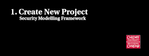

# SecMof Documentation

| Date       | Author        | Comments                                       | Version |
| ---------- | ------------- | ---------------------------------------------- | ------- |
| 25.10.2023 | Peter Maynard | Converted Install guide from word to markdown. | 0.1.0   |
| 13.06.2023 | Peter Maynard | Initial Setup Guide.                           | 0.1.0   |

## Table of Contents

* [Videos](#Videos)

  Four videos showing how to use the tool.  
  
* [Installation and Quick Start Guide](#Installation-and-Quick-Start-Guide)

  This guides briefly covers the Windows download and setup for Cardiff University machines (The steps are similar for other systems). Along with importing an example project containing a example Dependency Model and Playbook Process. 

* [Import Existing Dependency Model](#Import-Existing-Dependency-Model)

  This covers how to import existing models into an existing project. Using one of the example models from this repository. 

* [Export Projects](#Export-Projects)

  Explains the steps to export the project and models as a zipped archive. 

For additional example models and project files see the Examples and Templates directory.

## Videos

Click on the icons below for a video recording showing how to use the tool.

# Installation and Quick Start Guide

## 1. Download SecMof

https://github.com/CardiffUniCOMSC/SecMoF/releases/download/v0.1.0/Security.Modelling.Framework_1.0.0.202301201418-win32.win32.x86_64.zip

## 2. Extract to Desktop

Make sure it is the following location, otherwise Windows will fail to extract with an error relating to "path names too long." 

`C:\Users\<username>\Desktop\SecMoF`

Trouble Extracting

Still can't extract the archive, double check you're extracting to the correct location.

If that's not fixing it, try running the following in the command prompt: 

`tar -xf Security.Modelling.Framework_1.0.0.202301201418-win32.win32.x86_64.zip`

Finally, try renaming `Security.Modelling.Framework_1.0.0.202301201418-win32.win32.x86_64.zip`  to `SecMof.zip` then extract. 

## 3. Download the Example Project to Desktop

No need to extract it, this will be read be eclipse later on.

https://github.com/CardiffUniCOMSC/SecMoF/raw/main/ExamplesAndTemplates/Projects/example-project.zip

## 4. Start SecMof

Double click on the 'SecMof' application. 

## 5. Select Workspace

The tool will ask where you want to keep your data and related files. The default is fine. Inside this directory you will find any projects and artifacts you create with the tool.

## 6. Import Example Project

Import projects > Existing Projects into Workspace [Next] > Select archive file [Finish]

## 7. Enable Modelling View

Window > Perspective > Open Perspective > Other > Modelling [Open]

## 8. Success

You should now see the example project, with a sample Playbook and Dependency Model. 

### **Example Dependency Model**

The Model Explorer pane (**A**) contains an overview of all paragons within the dependency model. 

The Palette pane (**B**) allows you to create new paragons, by clicking "*Create[OR|AND]Dependency*" then selecting an existing node in the Main Viewer pane (**C**) to be the new node's parent.

### Example Playbook Process

The Model Explorer pane (**A**) contains an overview of all the Playbook Process and Artifacts. 

The Palette pane (**B**) allows you to create new a new Activity, Artifact in State, Associate Reference, Assign Actuator, and to mark activities as complete. 

The main Viewer pane (**C**) shows two Activities linked.

# Import Existing Dependency Model

## 1. Download Model 

Find and download the Dependency Model as an XML file to your Desktop. 

https://github.com/CardiffUniCOMSC/SecMoF/blob/main/ExamplesAndTemplates/DependencyModelExamples/SCADA.dependencymodel

## 2. Import Model into Project

Right Click on project (example) -> Import -> File System -> Identify Directory [Desktop] -> Check "SCADA.dependencymodel" [Finish]

# Export Projects

If you wish to export the models for use on another computer or to send to someone. You can export as a archive file. 

## 1. Export as Archive

File > Export > General > Archive File > Check ‘example’ > Save to Desktop as a zip.

*This work is licensed under [CC BY-SA 4.0](http://creativecommons.org/licenses/by-sa/4.0).* 